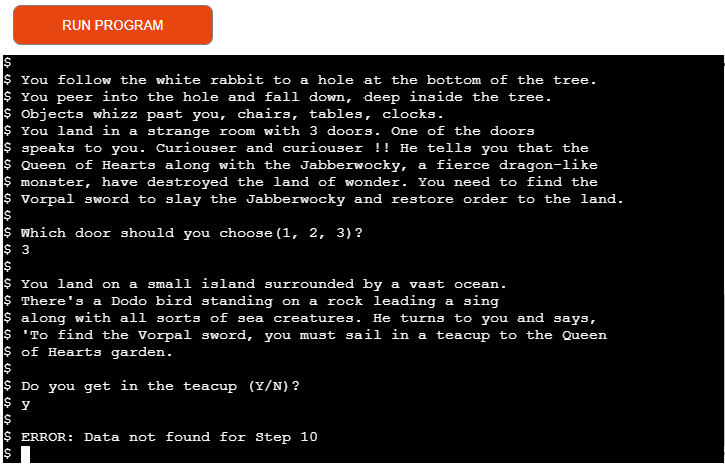

# Adventures of Alice

The Adventures of Alice is a text based adventure game. The game is based on the story of 'Alice's Adventures in Wonderland' and 'Through the Looking glass' by Lewis Carroll. The player is taken through a land of wonder and meets many fantastic creatures along the way. The aim of the game is to find the Vorpal sword and slay the Jabberwocky, a fierce dragon-like creature, who along with the Queen of Hearts has control over Wonderland. There is a short introduction to the game and the player is asked to enter their name. The player is asked a series of questions. Depending on how they answer these questions they will go through a series of different adventures and may or may not slay the Jabberwocky and restore order to Wonderland.

## Multi Screen mock-up of the game

## Design of the game
### Flowchart

## Features/Functions
### Existing Features

* The player is presented with a screen that gives an introduction to the game
and they are asked to enter their name to start their adventure. 

If a player wants to restart the game at any time they can simply click on the run program button.

If a name is not entered a message will be displayed to inform the player that to play the game they must enter a name. This function will continue to loop until a players name is entered.

* If a players name is entered, the capitalize() method is used to format the name entered and it is printed in a welcome statement. 
* The first step in the story begins. The player is presented with an option to follow the white rabbit. The function will get all values from the Google Sheets data.
* It will create a sublist of the values needed to validate the input from the player.
* It will return the output for the current step and the value of the next the next step.

* If the players input response does not exist as a valid response for the current step in the game, an error message will be displayed and the player will have to enter the correct response to continue.

* In the current data model there are seven ways to lose the game and two different ways to win. This is configurable.
* A tally of the players wins and losses are accumulated and displayed to the player at the end of each game.
* The player is also given the option to play again.

This shows one of the possible wins.

This shows one of the possibe losses.

* There is functionality to validate the data in the Google Sheets data structure. For example, if a next step is missing in the Google Sheets, the program  will output an error to alert the user that the data is missing and the data model is compromised.

### Use of Python 

While coding this game I intially used a for loop to loop through the list of data that had been retreived from the Google Sheets. This loop would create a sublist of the data that was needed for validation and to get the next step. Using google I discovered a more powerful pythonic way of doing this in just one line using a lambda function. These are screen shots of my code as I had it before putting in the lambda function.

These are the two websites I read to achieve this goal :

https://www.pythontutorial.net/python-basics/python-filter-list/

https://www.analyticsvidhya.com/blog/2020/03/what-are-lambda-functions-in-python/

### Future Features 
* The game could be extended to hold numerous stories. The player could be presented with a menu of different adventures to play. The Google Sheets could be extended to hold a story name column.
* An extra sheet could be updated to store the players name and tally of wins/losses.
* The game could have more options and extra scenarios to make it more interesting and complex. More characters from the original story, such as Tweedledee and Tweedledum could have been added.
* Art, maybe ASCII art, could be used to display the many iconic symbols associated with Alice in Wonderland, such as: a potions bottle, a drink me or eat me label or the Mad Hatters top hat perhaps.

## Data Model

This game uses Google Sheets to store all the data for the game. The Adventures-of-Alice spreadsheet is comprised of two sheets. The AlicePrompt sheet stores two values, Step and User Prompt. The value in Step is numeric and represents where the player is in the game. The User Prompt holds the story content as well as the question the play is asked to respond to. This is printed to the screen.

The second sheet, AliceFlow, also stores the Step. The Step values should correspond to the values stored in the Step field in AlicePrompt. It also holds Response, which holds all the possible valid answers that the player may enter for the step that they are at in the game. The next value stored is Output, which will hold the possible outcomes based on the response the player enters. And finally, AliceFlow sheet stores the next step of the game also based on the players response.

The next step can be a numeric value but can also hold a Win or Lose value, which will end the game. The link for a copy of the Adventures Of Alice Google Sheets is here:
https://docs.google.com/spreadsheets/d/1bUZLqS3Y8-wCncuKFJdtRpnGloQ8lo0SaEltfV9jUIk/edit?usp=sharing

### Development of Data Model

When I first approached this project and decided to do a text based adventure game, I wanted the text and story content to be separate from my Python code. I wanted my program to open, read and manipulate the data rather than be hard coded into my program.

I experimented by using a text file, called story.txt in my gitpod repository. I initially used the open file, readlines, close file code in my program but then after some research I discovered the linecache.getlines() method and used this to read certain lines from the text file depending on where the player was in the story by using parameters of the file name and line number. I used the following sites to look this method up:  https://www.geekforgeek.org and https://docs.python.org

The code is below:

After reviewing the Love Sandwiches mini project, I felt it may be better to use Google Sheets to store the story line and content. I also realised that  I could also use it to store the valid answers to each player prompt, the output and the next step of the game. Hence, I discarded my original idea of using a text file to store and read in the relevant lines and used Google Sheets instead.
## Technology
### Language Used

* [Python](https://www.python.org) - Python is an interpreted high-level general-purpose programming language. I used Python to access the data in Google Sheets and run the game.

### Other Technologies and Libraries

* [GitPod](https://gitpod.io) - Gitpod is an online cloud based IDE. I developed and tested my project using Gitpod. I added and commited changes with messages and pushed to GitHub.
* [GitHub](https://github.com) - GitHub is a provider of Internet hosting for software development and version control using Git.
* [Heroku](https://heroku.com) - Heroku is a cloud platform as a service supporting several programming languages. I used Heroku to deploy and run the project.
* [Google Chrome Browser](https://www.google.com/intl/en_ie/chrome/) - was used to view the game.
* [Google Cloud Platform](https://cloud.google.com) - was used to set up the API's for the project.
* [Google Sheets](https://www.google.com/sheets/about/) - used to store the story flow, the story content, story prompts and the next steps for the game. 
* [Diagrams](https://wwww.diagrams.net) - used to create the flowchart for the project.
## API
Set up API to access the data in the Google Sheets

* Go to the [Google Cloud Platform](https://cloud.google.com) page.
* Click on 'Select a Project' button.
* Select 'New Project' and enter project name, 'AdventuresOfAlice' and click 'Create'
* Select project to bring you to the project page.
* Select the 'APIs & Services' option from the side menu.
* Select 'Library' to enable two APIs, Google Drive to get credentials to access the Google files and the second API will be to Google Sheets.
* In the search bar enter 'Google Drive' and select it from the list.
* Click the 'Enable' button.
* From the "Which API are you using?" choose Google Drive API.
* For the "What data will you be accessing?" select Application Data.
* For the "Are you planning to use this API with Compute Engine, Kubernetes Engine, App Engine, or Cloud Functions?" select No, I'm not using them.
* Click Next
* Enter Service Account details, 'AdventuresOfAlice' and click 'Create.
* For Role click 'Editor' and click 'Continue'.
* On the next page click on the Service Account that was created.
* On the next page click on 'KEYS' tab.
* Click on 'Add' key and 'Create New Key'
* Select 'JSON' and click 'Create'
* To select the Google Sheets API, go back to the 'Library' and search for 'Google Sheets'.
* Select 'Google Sheets API' and click 'Enable'.

## CREDS.JSON

* Copy the credentials file created into my gitpod repository and rename it to 'creds.json'
* Ensure the 'creds.json' file is added to the 'gitigore' file as it should not be pushed to GitHub.
* Take a copy the email address generated from the creds.json file.
* In the Google Sheets click 'Share' button and paste in the email address.
* Select 'Editor' and untick 'Notify People, then click 'Share'.

## Testing
### Manual Testing
* Ensure that API is working and that my code is able to access the data in the google sheets. I initially tested this by putting two rows of data in the google sheet and printing the data to screen.
* Test the validation of a player name entered. If the player name is not entered, an error message should appear and the user will be prompted for a name again.
* Test validation against the reponses in the data model. If a response is entered by the player other than the responses in the google sheet an error message should display and the player is prompted again with the same question.
* Test that the correct story content and prompt is appearing for the current step of the game.
* Make sure that the correct value in the next step is moved into the current step when the player has entered a valid response for that step.
* If there is data in the output column ensure that the correct output content is printing.
* If the next step is a 'Win' or 'Lose' step make sure that the correct ouptut is printed to the screen. Also test that the correct accummulated tallies of wins and losses are printed.
* Ensure that the player is promted to play again if the next step is 'Win' or 'Lose'.
* If the data in the data structure is not setup properly, ensure that an informative error message should appear with the current step of the game printed on screen.
* Test that the flow of the story makes sense, that for each step the next step is a valid, realistic move.
* Used the Google Sheets data as a checklist to test that all of the next steps and outputs were correct and the flow of the game was correct.

### Validator Testing

PEP8 online check
http://pep8online.com

* No errors were found in the code 

## Bug Fixes

* There are headings in the data model of 'Step', 'User Prompt', 'Response' 'Output' and 'Next Step'. Because the first item in the array is a string I was having difficulty in my 'validating user response' function where I wanted to do a comparison for the step in the game. To sort this problem out I had to put an extra 'if' statement in my loop to check if the first item is numeric by using the isnumeric()method.

* Data errors in data model. If there was no entry in the Google Sheets for the next step in the game, the game would fail. I had to put in a message to alert the player that there was an issue with the data structure and display the step in the game that they had reached.

* When I initially started this game, I was not using Google Sheets to store the data. I deployed my site early to ensure that I understood the deployment process and that it worked properly. I therefore had not added the config var to Heroku. When I did this I still had a problem but relaised that I had not populated my 'requirments.txt' file in GitPod. Once I did this the game ran without a problem. 

## Deployment

The application uses Heroku for deployement

### Create the application
1. Create the requirements file the Heroku will use to import the dependencies required for deployment: type pip3 freeze > requirements.txt. 

2. Navigate to the [Heroku](https://heroku.com) website
3. Create an account by entering your email address and a password
4. Activate the account through the authentication email sent to your email account
5. Click the new button and select create a new app from the dropdown menu
6. Enter a name for the application which must be unique, in this case the app name is adventures-of-alice
7. Select a region, in this case Europe
8. Click create app
## Heroku settings
1. From the horizontal menu bar select 'Settings'.
2. In the buildpacks section, where further necessary dependencies are installed, click 'add buildpack'. Select 'Python' first and click 'save changes'. Next click 'node.js' and then click 'save changes' again. The 'Python' buildpack must be above the 'node.js' buildpack'. They can be clicked on and dragged to change the order if necessary.
### Deployment
1. In the top menu bar select 'Deploy'.
2. In the 'Deployment method' section select 'Github' and click the connect to Github button to confirm.
3. In the 'search' box enter the Github repository name for the project. Click search and then click connect to link the heroku app with the Github repository. The box will confirm that heroku is connected to the repository which in this case is [Adventures of Alice](https://github.com/catrionamcd/adventures-of-alice).
4. Scroll down to select either automatic or manual deployment. For this project automatic deployment was selected. If you wish to select automatic deployment select the button 'Enable Automatic Deploys'. This will rebuild the app every time a change is pushed to Github. If you wish to manually deploy click the button 'Deploy Branch'. The default 'Master' option in the dropdown menu should be selected in both cases.
5. When the app is deployed a message 'Your app was successfully deployed' will be shown. Click 'view' to see the deployed app in the browser. The live deployment of the project can be seen here
6. The app starts automatically and can be restarted by pressing the 'Run Program' button.

## Forking the Repository
If you wish to fork the repository to make changes without affecting the original you can fork the repository

1. Navigate to the [Adventures of Alice](https://github.com/catrionamcd/adventures-of-alice) repository
2. Click the 'Fork' button at the top right of the page.
3. A forked copy of the repository will appear in your Repositories page.
## Cloning the Repository
1. On [GitHub](https://github.com) navigate to the main page of the  [Adventures of Alice](https://github.com/catrionamcd/adventures-of-alice) repository.
2. Above the list of files click the dropdown code menu.
3. Select the https option and copy the link.
4. Open the terminal.
5. Change the current working directory to the desired destination location.
6. Type the git clone command with the copied URL: git clone https://github.com/catrionamcd/adventures-of-alice.git.
7. Press enter to create the local clone.

Press enter to create the local clone.

## Credits
### Content
* Adventures of Alice in Wonderland by Lewis Carroll
* Through the looking glass by Lewis Carroll
* Disney movies - Alice in Wonderland 1951 & 2010
### Code
* [w3schools] - https://www.w3schools.com
* [stackoverflow] - https://www.stackoverflow.com
* [pythontutorials] - https://www.pythontutorial.net
* [analyticsvidhya] - https://www.analyticsvidhya.com
* [geeksforgeeks] - https://www.geekforgeek.org
* [python] - https://docs.python.org

* I would like to credit my mentor Maria Hynes who kept me informed and advised me with my approach to the python code and my README. She also enlisted members of her own family to play/test my game and give feedback.
* I would also like to credit my own family for testing the game over and over on their laptops and phones. They all enjoyed both the original animated version of the Disney movie and the more recent Disney/Tim Burton adaptation. 

