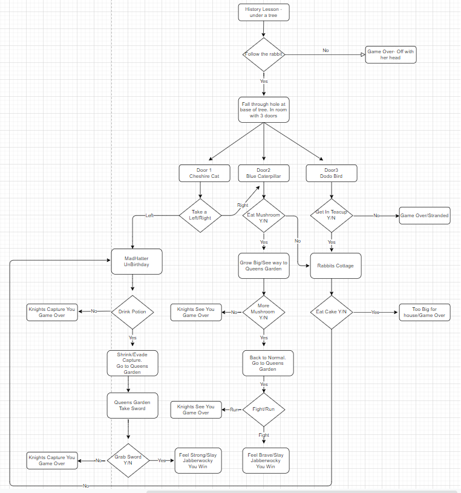

# Adventures of Alice

The Adventures of Alice is a text based adventure game. The game is based on the story of Alice's Adventures in Wonderland and Through the Looking glass by Lewis Carroll. The player is taken through a land of wonder and meets many fantastic creatures along the way. The aim of the game is to find the Vorpal sword and slay the Jabberwocky, a fierce dragon like creature, who along with the Queen of Hearts has control over Wonderland. There is a short introduction to the game and the player is asked to enter their name. The player is asked a series of questions. Depending on how they answer these questions they will go through a series of different adventures and may or may not slay the Jabberwocky and restore order to Wonderland.

## Design of the game
### Flowchart

## Features/Functions
### Existing Features
### Future Features 
## Data Model

This game uses Google sheets to store all the data for the game. The Adventures-of-Alice sheet is comprised of two sheets. The AlicePrompt sheet stores two values, Step and User Prompt. The value in Step is numeric and represents where the player is in the game. The User Prompt holds the story content and the prompt which are both printed to the screen.

The second sheet, AliceFlow, also stores the Step. The Step values should correspond to the values stored in the Step field in AlicePrompt. It also holds Response, which holds all the possible valid answers that the player may enter for the step that they are at in the game. The next value stored is Output, which will hold the possible outcome for what the player has chosen to enter. And finally, AliceFlow sheet stores the Next Step, which stores the next step of the game depending on how the player answered.

The next step can be a numeric value but can also hold a Win or Lose value, which will end the game. The link for a copy of the Adventures Of Alice google sheets is below:
https://docs.google.com/spreadsheets/d/1bUZLqS3Y8-wCncuKFJdtRpnGloQ8lo0SaEltfV9jUIk/edit?usp=sharing

### Development of Data Model

When I first approached this project and decided to do a text based adventure game I wanted the text and story content to be separate from my Python code. I wanted to store my data separately to be opened, read and manipulated by the code but not hard coded into my program.

I experimented by using a txt file, called story.txt in my gitpod repository. I initially use the open file, readlines, close file code in my program but then after some research discovered linecache.getlines module and used this to read certain lines from the text file depending on where the player was in the story by using parameters of the file name and line number. The code is below:

After reviewing the love Sandwiches mini project, I felt it may be better to used Google Sheets to store the story line and content. I also realised that  I could also used it to store the valid answers to each player prompt, the output and the next step of the game. Hence, I discarded my original idea of using a text file to store and read in the relevant lines.
## Technology
### Language Used

* Python3

### Framework, Libraries, Programs Used

* GitPod - Git was used for version control by utilizing the Gitpod terminal to add and commit changes with messages to Git and Push to GitHub.
* GitHub - used to store the project code.
* Heroku - used to deploy and run the project.
* Google Sheets - used to store the story flow, the story content, story prompts and the next steps for the game. 
* Diagrams - used to create the flowchart for the project.

## Testing

PEP8 online check
http://pep8online.com

* No errors were found in the code 

## Deployment
Deployment
The application uses Heroku for deployement

To create the application:
First create the requirements file the Heroku will use to import the dependencies required for deployment: type pip3 freeze > requirements.txt. 

Navigate to the Heroku website
create an account by entering your email address and a password
Activate the account through the authentication email sent to your email account
Click the new button and select create a new app from the dropdown menu
Enter a name for the application which must be unique, in this case the app name is after-the-party
Select a region, in this case Europe
Click create app
Heroku settings
From the horizontal menu bar select 'Settings'.
In the buildpacks section, where further necessary dependencies are installed, click 'add buildpack'. Select 'Python' first and click 'save changes'. Next click 'node.js' and then click 'save changes' again. The 'Python' buildpack must be above the 'node.js' buildpack'. They can be clicked on and dragged to change the order if necessary.
Deployment
In the top menu bar select 'Deploy'.
In the 'Deployment method' section select 'Github' and click the connect to Github button to confirm.
In the 'search' box enter the Github repository name for the project. Click search and then click connect to link the heroku app with the Github repository. The box will confirm that heroku is connected to the repository which in this case is Adventures of Alice.
Scroll down to select either automatic or manual deployment. For this project automatic deployment was selected. If you wish to select automatic deployment select the button 'Enable Automatic Deploys'. This will rebuild the app every time a change is pushed to Github. If you wish to manually deploy click the button 'Deploy Branch'. The default 'Master' option in the dropdown menu should be selected in both cases.
When the app is deployed a message 'Your app was successfully deployed' will be shown. Click 'view' to see the deployed app in the browser. The live deployment of the project can be seen here
The app starts automatically and can be restarted by pressing the 'Run Program' button.

Forking the Repository
If you wish to fork the repository to make changes without affecting the original you can fork the repository

Navigate to the adventures-of-alice repository
Click the 'Fork' button at the top right of the page.
A forked copy of the repository will appear in your Repositories page.
Cloning the Repository
On GitHub navigate to the main page of the repository.
Above the list of files click the dropdown code menu.
Select the https option and copy the link.
Open the terminal.
Change the current working directory to the desired destination location.
Type the git clone command with the copied URL: git clone https://github.com/catrionamcd/adventures-of-alice.git.

Press enter to create the local clone.

## Credits

* Adventures of Alice in Wonderland by Lewis Carroll
* Through the looking glass by Lewis Carroll
* Disney movies - Alice in Wonderland 1951 & 2010
               

